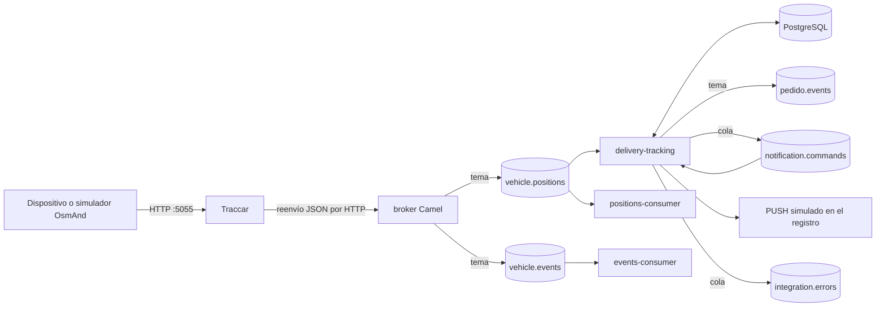
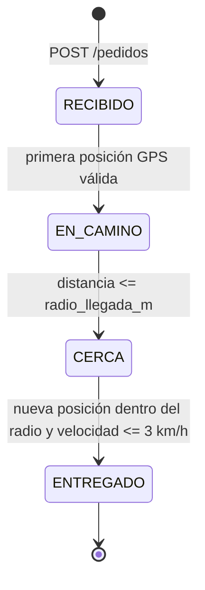

# Seguimiento de pedidos delivery con Traccar, Camel y Artemis

## Integrantes

- Ana Paula Duarte
- Steven Gracia Ayala

## Descripción del proyecto

Proyecto de integración orientada a eventos para el seguimiento de pedidos de delivery mediante coordenadas GPS. Reúne la recepción de posiciones, la mensajería, la persistencia, el cálculo de distancia, los cambios de estado y las notificaciones en un flujo completo y reproducible.

## Objetivo

El sistema recibe posiciones GPS reales a través de Traccar, las transforma a un modelo canónico y las distribuye con Apache ActiveMQ Artemis. El módulo `delivery-tracking` correlaciona el `uniqueId` del dispositivo con un pedido activo, persiste su última posición y ejecuta las transiciones `RECIBIDO -> EN_CAMINO -> CERCA -> ENTREGADO`.

La solución usa coreografía: el broker publica hechos canónicos y los consumidores reaccionan sin un coordinador central. Dentro de `delivery-tracking` existe una máquina de estados determinista que mantiene el orden correcto del pedido.

## Tecnologías utilizadas

| Tecnología | Versión/configuración |
| --- | --- |
| Java | 21.0.10 (compilación y ejecución) |
| Gradle Wrapper | 9.6.0 |
| Apache Camel | 4.8.0 |
| Cliente Jakarta JMS de Artemis | 2.31.2 |
| Broker Artemis | imagen `apache/activemq-artemis:latest-alpine`; 2.44.0 en la validación final |
| PostgreSQL | imagen `postgres:17-alpine`; 17.11 en la validación final |
| Traccar | imagen `traccar/traccar:latest`; 6.15.3 en la validación final |
| JBang | guion utilitario `scripts/delivery-smoke.java`; no ejecuta los servicios |

Las imágenes `latest` facilitan la práctica, pero no garantizan reproducibilidad binaria futura. Para producción deben fijarse por versión o digest.

## Sistemas participantes

- **Traccar:** recibe las coordenadas GPS mediante el protocolo OsmAnd y las reenvía por HTTP.
- **Broker Camel:** recibe el JSON de Traccar, identifica su tipo y lo convierte al modelo canónico.
- **ActiveMQ Artemis:** distribuye posiciones, eventos, comandos y errores.
- **Delivery Tracking:** administra pedidos, estados, distancias, eventos y notificaciones.
- **PostgreSQL:** guarda repartidores, pedidos, últimas posiciones y eventos.
- **Consumidores de posiciones y eventos:** mantienen suscripciones durables y registran los mensajes recibidos.

## Arquitectura



## Flujo de integración

Flujo real de una posición:

1. OsmAnd envía el GPS a Traccar por el puerto `5055`.
2. Traccar hace `POST /traccar/ingest` al broker.
3. Camel aplica clasificación y traducción al `VehiclePosition` canónico.
4. Artemis distribuye `vehicle.positions` a sus suscriptores durables.
5. `delivery-tracking` correlaciona `device.uniqueId` con `pedidos.repartidor_device_id`, consulta el pedido y calcula Haversine.
6. PostgreSQL guarda la posición; una transición y su evento se confirman en la misma transacción.
7. El proceso periódico de salida publica el evento en `pedido.events` y el comando en `notification.commands`.
8. El consumidor de notificaciones emite un PUSH simulado y marca el hito como notificado.

El módulo `mediator` conserva una alternativa experimental de entrada por Artemis, pero no está desplegado en `compose.yaml`; el flujo en ejecución entra por HTTP al módulo `broker`.

## Estados del pedido



- `RECIBIDO`: pedido creado y asignado a un repartidor existente.
- `EN_CAMINO`: primera posición GPS válida del pedido activo.
- `CERCA`: distancia Haversine al destino menor o igual a `radio_llegada_m`.
- `ENTREGADO`: posición posterior, todavía dentro del radio, con velocidad menor o igual a `3 km/h`.

No se aceptan regresiones. Una posición cuya fecha y hora no sea estrictamente posterior a la última guardada se clasifica como antigua y no modifica el pedido.

## API y endpoints

Con la configuración por defecto, la API se publica en `http://localhost:8083`.

### Crear pedido

```http
POST /pedidos
Content-Type: application/json
```

```json
{
  "id": "PED-001",
  "cliente_nombre": "Cliente Demo",
  "cliente_msisdn": "+595981000001",
  "cliente_fcm_id": "fcm-demo",
  "direccion_texto": "Av. España 1234",
  "lat_destino": -25.2967,
  "lon_destino": -57.6359,
  "radio_llegada_m": 150,
  "repartidor_device_id": "repartidor-01"
}
```

Respuesta `202`:

```json
{"id":"PED-001","estado":"RECIBIDO","fecha_creacion":"2026-09-19T00:00:00Z"}
```

### Consultar seguimiento

```http
GET /pedidos/PED-001/tracking
```

```json
{
  "pedido_id": "PED-001",
  "estado": "ENTREGADO",
  "posicion": {
    "lat": -25.2968,
    "lon": -57.636,
    "velocidad_kmh": 1.852,
    "distancia_destino_m": 14.99,
    "timestamp": "2026-09-19T00:17:53Z"
  }
}
```

## Persistencia

- `repartidores`: catálogo por `device_id`; los datos iniciales incluyen `repartidor-01` y `repartidor-02`.
- `pedidos`: destino, radio, cliente, repartidor y estado actual. Un índice parcial permite como máximo un pedido activo por repartidor.
- `pedido_ultima_posicion`: una posición por pedido, con fecha y hora, velocidad y distancia calculada.
- `pedido_eventos`: historial y tabla de salida con `message_id`, tipo, estados e indicadores `publicado` y `notificado`.

La actualización del estado y la inserción de su evento comparten una transacción JDBC. `UNIQUE (pedido_id, hito)` impide duplicar hitos y el `UPDATE ... WHERE estado = estado_esperado` evita carreras y regresiones.

La distancia se calcula mediante la fórmula Haversine sobre el radio medio terrestre, adecuada para estas distancias urbanas.

## Mensajería con Artemis

| Canal | Tipo | Productor | Consumidor |
| --- | --- | --- | --- |
| `ingest` | cola / anycast | puerta de enlace HTTP del broker | traductor del broker |
| `vehicle.positions` | tema / multicast | broker | consumidores durables de posiciones y delivery |
| `vehicle.events` | tema / multicast | broker | consumidor durable de eventos |
| `pedido.events` | tema / multicast | tabla de salida de delivery | extensiones de negocio; no hay consumidor en Compose |
| `notification.commands` | cola / anycast | tabla de salida de delivery | consumidor PUSH de delivery |
| `integration.errors` | cola / anycast | Dead Letter Channel | inspección y operación; no hay consumidor en Compose |

Aunque las rutas se llaman `amqp:` en Camel, la `ActiveMQConnectionFactory` usada es el cliente Jakarta de Artemis y su URL real es Core JMS: `tcp://artemis:61616`. Artemis también expone AMQP 1.0 en `5672`, pero estos servicios no usan Qpid JMS.

## Patrones EIP utilizados

| Patrón | Aplicación real |
| --- | --- |
| Messaging Gateway | `POST /traccar/ingest` desacopla Traccar del bus interno. |
| Content-Based Router | el broker separa mensajes `position` y `event`. |
| Message Translator | traductores Traccar convierten al modelo canónico. |
| Canonical Data Model | `VehiclePosition` y `VehicleEvent` viven en `common`. |
| Publish-Subscribe Channel | temas `vehicle.positions`, `vehicle.events` y `pedido.events`. |
| Durable Subscriber | consumidores de posiciones/eventos mantienen suscripciones con `clientId`. |
| Correlation Identifier | `device.uniqueId`, `pedido_id` y `message_id` viajan y se guardan para correlación. |
| Content Enricher | el seguimiento cruza la posición con el pedido y el destino en PostgreSQL, y agrega distancia y estado. |
| Message Filter | se descartan posiciones inválidas y comandos que no son hitos notificables. |
| Idempotent Receiver | fecha creciente, estado esperado y restricciones únicas permiten reprocesar sin duplicar. |
| Event Message | `pedido.estado-cambiado`, `pedido.cerca` y `pedido.entregado`. |
| Dead Letter Channel | tres reintentos antes de publicar un error depurado en `integration.errors`. |

No se usa Wire Tap: la publicación del evento y del comando es explícita dentro de la ruta de salida.

## Eventos de dominio

Cada evento de dominio contiene `messageId`, `pedido_id`, `device_id`, estado anterior, estado nuevo, fecha y hora, y distancia cuando corresponde. La tabla de salida consulta cada segundo hasta 100 eventos no publicados, envía primero a `pedido.events`, luego a `notification.commands` y finalmente marca `publicado=true`.

No hay una transacción distribuida entre PostgreSQL y Artemis. Una caída entre el envío y `publicado=true` puede volver a publicar el evento. Los consumidores deben ser idempotentes; el consumidor PUSH ya cumple esta condición.

## Notificaciones PUSH

El PUSH es simulado por `LoggingPushGateway`. Para `EN_CAMINO`, `CERCA` y `ENTREGADO`, el consumidor bloquea la fila del evento, verifica `notificado`, envía y solo entonces confirma `notificado=true`.

## Manejo de errores

Las rutas de posiciones, salida de eventos y PUSH permiten hasta 3 reintentos, separados por 100 ms. Al agotarse, `IntegrationErrorProcessor` genera un mensaje sin credenciales, traza completa ni contenido sensible y lo envía a `integration.errors`. El mensaje incluye el motivo, el origen, la fecha y hora, y las correlaciones disponibles.

## Idempotencia

La restricción `UNIQUE (pedido_id, hito)` impide registrar dos veces el mismo hito. El bloqueo de la fila durante el envío garantiza como máximo una notificación exitosa por hito. Además, solo se procesan posiciones con una fecha posterior a la última guardada y cada transición exige el estado anterior correcto.

## Estructura

```text
common/              modelos canónicos compartidos
broker/              puerta de enlace HTTP, clasificación y traducción
mediator/            alternativa no desplegada en Compose
positions-consumer/  suscriptor durable y registro de posiciones
events-consumer/     suscriptor durable y registro de eventos
delivery-tracking/   API, estados, PostgreSQL, salida de eventos, PUSH y errores
traccar/              configuración de forwarding y protocolos GPS
scripts/              simuladores y prueba rápida con JBang
docs/e2e.md           procedimiento E2E reproducible
evidencias/           lista de capturas manuales
```

Los contenedores Java se construyen con la distribución `installDist` de Gradle, en lugar de un JAR único artesanal, para conservar todos los metadatos y conversores de Camel.

## Instalación y ejecución

Requisitos:

- JDK 21 para compilación local;
- Docker con Compose y BuildKit;
- JBang solo para la prueba rápida opcional.

```bash
git clone https://github.com/PauliDuarte/traccar-fleet-integration.git
cd traccar-fleet-integration
cp .env.example .env
./gradlew clean test
docker compose build
docker compose up -d
docker compose ps
```

Puertos por defecto:

- broker HTTP `8080`;
- API de pedidos `8083`;
- Traccar UI/API `8082`, OsmAnd `5055`;
- PostgreSQL host `5433`;
- Artemis AMQP `5672`, Core `61617`, MQTT `1883`, consola `8162`.

Todos pueden ajustarse en `.env` sin cambiar los puertos internos. La consola Artemis queda en `http://localhost:8162/console` con las credenciales de `.env`.

Para detener:

```bash
docker compose down
```

Para eliminar además la base de la práctica:

```bash
docker compose down -v
```

## Seguimiento GPS con Traccar

Traccar usa H2 embebido para su catálogo de prueba y tiene habilitado el protocolo OsmAnd. Tras registrar un usuario y un dispositivo cuyo `uniqueId` sea `repartidor-01`, una posición puede enviarse así:

```bash
curl "http://localhost:5055/?id=repartidor-01&lat=-25.3100&lon=-57.6500&timestamp=$(date +%s)&speed=10"
```

## Cálculo de distancia

El servicio aplica la fórmula Haversine a la posición GPS y las coordenadas del destino. El resultado se guarda en metros en `pedido_ultima_posicion` y se usa para decidir los estados `CERCA` y `ENTREGADO`.

## Prueba end to end

La guía completa, desde un entorno limpio hasta `ENTREGADO`, está en [docs/e2e.md](docs/e2e.md). La prueba usa Traccar, Artemis, PostgreSQL, el broker y el servicio de pedidos reales, sin reemplazarlos por simulaciones internas.

## Uso real de JBang

JBang no participa en la ejecución de los servicios. Proporciona un cliente de prueba rápida que crea un pedido y consulta su seguimiento con Java 21:

```bash
jbang scripts/delivery-smoke.java http://localhost:8083 PED-JBANG-001 repartidor-01
```

El archivo existe como utilidad opcional. No se afirma que haya sido ejecutado, porque JBang no estaba instalado durante la validación. La aplicación principal se ejecuta con Gradle y Camel Main.

## Pruebas automatizadas

```bash
./gradlew clean test --rerun-tasks
docker compose config --quiet
git diff --check
```

El conjunto contiene 35 pruebas: API, validaciones, Haversine, repositorios, transiciones, orden temporal, guardado atómico, eventos, notificaciones, idempotencia, reintentos y traducción del `uniqueId` de Traccar. Las pruebas unitarias de repositorio usan H2; la validación de infraestructura usa PostgreSQL y Artemis reales según [docs/e2e.md](docs/e2e.md).

## Limitaciones conocidas

- Traccar usa H2 dentro de su contenedor y pierde su configuración al recrearlo.
- Las imágenes con la etiqueta `latest` pueden cambiar; las versiones indicadas son las observadas durante la validación.
- `pedido.events` e `integration.errors` no tienen consumidor operativo incluido; se inspeccionan en Artemis.
- El PUSH es un adaptador simulado por log, no una integración con FCM/APNs.
- La tabla de salida se consulta periódicamente y ofrece entrega al menos una vez; no usa CDC ni garantiza entrega distribuida exactamente una vez.
- Las credenciales por defecto son solo para desarrollo local.
- JBang debe instalarse por separado para ejecutar la prueba rápida; la compilación principal no depende de él.

## Evidencias

No se incluyen capturas inventadas. [evidencias/README.md](evidencias/README.md) enumera las capturas manuales sugeridas; el E2E comprobado se documenta con comandos y resultados en [docs/e2e.md](docs/e2e.md).

## Referencias

- [Apache Camel](https://camel.apache.org/)
- [ActiveMQ Artemis](https://activemq.apache.org/components/artemis/documentation/)
- [Traccar Forwarding](https://www.traccar.org/forward/)
- [Enterprise Integration Patterns](https://www.enterpriseintegrationpatterns.com/)

## Licencia

Proyecto académico para Integración de Sistemas II, UCOM.
