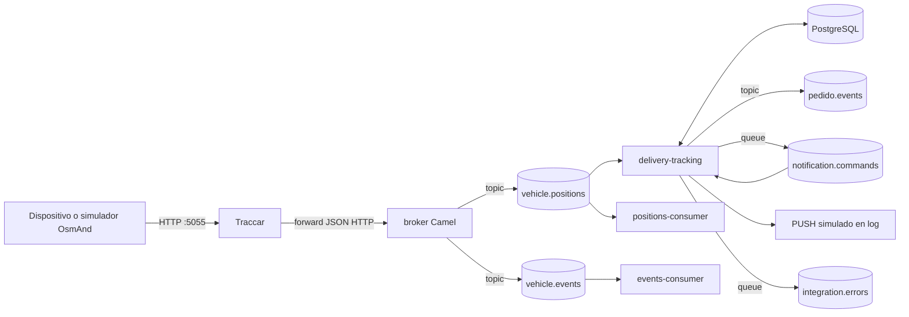
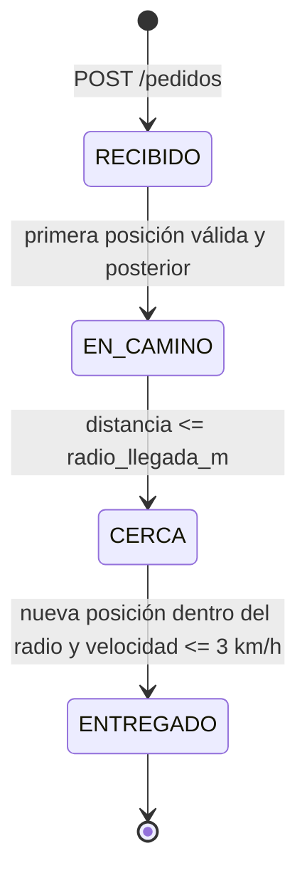

# Seguimiento de pedidos delivery con Traccar, Camel y Artemis

Proyecto universitario de integración dirigida por eventos para seguir un pedido mediante las coordenadas GPS del repartidor, calcular su distancia al destino y notificar hitos sin duplicados.

## Integrantes

- Ana Paula Duarte
- Steven Gracia Ayala

## Objetivo

El sistema recibe posiciones GPS reales a través de Traccar, las transforma a un modelo canónico y las distribuye con Apache ActiveMQ Artemis. El módulo `delivery-tracking` correlaciona el `uniqueId` del dispositivo con un pedido activo, persiste su última posición y ejecuta las transiciones `RECIBIDO -> EN_CAMINO -> CERCA -> ENTREGADO`.

La solución usa coreografía: el broker publica hechos canónicos y los consumidores reaccionan sin un coordinador central. Dentro de `delivery-tracking` sí existe una máquina de estados determinista para proteger el orden del agregado pedido.

## Stack verificado

| Tecnología | Versión/configuración |
| --- | --- |
| Java | 21 (toolchain y runtime) |
| Gradle Wrapper | 9.6.0 |
| Apache Camel | 4.8.0 |
| Artemis JMS client | 2.31.2 |
| Artemis broker | imagen `apache/activemq-artemis:latest-alpine`; 2.44.0 en la validación final |
| PostgreSQL | imagen `postgres:17-alpine`; 17.11 en la validación final |
| Traccar | imagen `traccar/traccar:latest`; 6.15.3 en la validación final |
| JBang | script utilitario `scripts/delivery-smoke.java`; no ejecuta los servicios |

Las imágenes `latest` facilitan la práctica, pero no garantizan reproducibilidad binaria futura. Para producción deben fijarse por versión o digest.

## Arquitectura



Flujo real de una posición:

1. OsmAnd envía el GPS a Traccar por el puerto `5055`.
2. Traccar hace `POST /traccar/ingest` al broker.
3. Camel aplica clasificación y traducción al `VehiclePosition` canónico.
4. Artemis distribuye `vehicle.positions` a sus suscriptores durables.
5. `delivery-tracking` correlaciona `device.uniqueId` con `pedidos.repartidor_device_id`, consulta el pedido y calcula Haversine.
6. PostgreSQL guarda la posición; una transición y su evento se confirman en la misma transacción.
7. El polling outbox publica el evento en `pedido.events` y el comando en `notification.commands`.
8. El consumidor de notificaciones emite un PUSH simulado y marca el hito como notificado.

El módulo `mediator` conserva una alternativa experimental de entrada por Artemis, pero no está desplegado en `compose.yaml`; el runtime real entra por HTTP al módulo `broker`.

## Estados y reglas



- `RECIBIDO`: pedido creado y asignado a un repartidor existente.
- `EN_CAMINO`: primera posición canónica válida del pedido activo.
- `CERCA`: distancia Haversine al destino menor o igual a `radio_llegada_m`.
- `ENTREGADO`: posición posterior, todavía dentro del radio, con velocidad menor o igual a `3 km/h`.

No se aceptan regresiones. Una posición cuyo timestamp no sea estrictamente posterior a la última persistida se clasifica como antigua y no modifica el agregado.

## API

Con la configuración por defecto, la API se publica en `http://localhost:8083`.

### Crear pedido

```http
POST /pedidos
Content-Type: application/json
```

```json
{
  "id": "PED-001",
  "cliente_nombre": "Cliente Demo",
  "cliente_msisdn": "+595981000001",
  "cliente_fcm_id": "fcm-demo",
  "direccion_texto": "Av. España 1234",
  "lat_destino": -25.2967,
  "lon_destino": -57.6359,
  "radio_llegada_m": 150,
  "repartidor_device_id": "repartidor-01"
}
```

Respuesta `202`:

```json
{"id":"PED-001","estado":"RECIBIDO","fecha_creacion":"2026-09-19T00:00:00Z"}
```

### Consultar tracking

```http
GET /pedidos/PED-001/tracking
```

```json
{
  "pedido_id": "PED-001",
  "estado": "ENTREGADO",
  "posicion": {
    "lat": -25.2968,
    "lon": -57.636,
    "velocidad_kmh": 1.852,
    "distancia_destino_m": 14.99,
    "timestamp": "2026-09-19T00:17:53Z"
  }
}
```

## Persistencia

- `repartidores`: catálogo por `device_id`; el seed incluye `repartidor-01` y `repartidor-02`.
- `pedidos`: destino, radio, cliente, repartidor y estado actual. Un índice parcial permite como máximo un pedido activo por repartidor.
- `pedido_ultima_posicion`: una posición por pedido, con timestamp, velocidad y distancia calculada.
- `pedido_eventos`: historial/outbox con `message_id`, tipo, estados, flags `publicado` y `notificado`.

La actualización del estado y la inserción de su evento comparten una transacción JDBC. `UNIQUE (pedido_id, hito)` impide duplicar hitos y el `UPDATE ... WHERE estado = estado_esperado` evita carreras y regresiones.

La distancia se calcula mediante la fórmula Haversine sobre el radio medio terrestre, adecuada para estas distancias urbanas.

## Topología Artemis

| Canal | Tipo | Productor | Consumidor |
| --- | --- | --- | --- |
| `ingest` | queue / anycast | gateway HTTP del broker | traductor del broker |
| `vehicle.positions` | topic / multicast | broker | positions-consumer y delivery-tracking durables |
| `vehicle.events` | topic / multicast | broker | events-consumer durable |
| `pedido.events` | topic / multicast | outbox delivery | extensiones de negocio; no hay consumidor en Compose |
| `notification.commands` | queue / anycast | outbox delivery | consumidor PUSH de delivery-tracking |
| `integration.errors` | queue / anycast | Dead Letter Channel | inspección/operación; no hay consumidor en Compose |

Aunque las rutas se llaman `amqp:` en Camel, la `ActiveMQConnectionFactory` usada es el cliente Jakarta de Artemis y su URL real es Core JMS: `tcp://artemis:61616`. Artemis también expone AMQP 1.0 en `5672`, pero estos servicios no usan Qpid JMS.

## EIPs implementados

| Patrón | Aplicación real |
| --- | --- |
| Messaging Gateway | `POST /traccar/ingest` desacopla Traccar del bus interno. |
| Content-Based Router | el broker separa payloads `position` y `event`. |
| Message Translator | traductores Traccar convierten al modelo canónico. |
| Canonical Data Model | `VehiclePosition` y `VehicleEvent` viven en `common`. |
| Publish-Subscribe Channel | topics `vehicle.positions`, `vehicle.events` y `pedido.events`. |
| Durable Subscriber | consumidores de posiciones/eventos mantienen suscripciones con `clientId`. |
| Correlation Identifier | `device.uniqueId`, `pedido_id` y `message_id` viajan y se guardan para correlación. |
| Content Enricher | delivery cruza la posición con pedido/destino en PostgreSQL y agrega distancia/estado. |
| Message Filter | se descartan posiciones inválidas y comandos que no son hitos notificables. |
| Idempotent Receiver | timestamp creciente, estado esperado y restricciones únicas toleran reprocesamiento. |
| Event Message | `pedido.estado-cambiado`, `pedido.cerca` y `pedido.entregado`. |
| Dead Letter Channel | tres redeliveries antes de publicar un error sanitizado en `integration.errors`. |

No se usa Wire Tap: la publicación de evento y comando es explícita dentro de la ruta outbox.

## Eventos, notificaciones y errores

Cada evento de dominio contiene `messageId`, `pedido_id`, `device_id`, estado anterior/nuevo, timestamp y distancia cuando corresponde. El outbox consulta cada segundo hasta 100 eventos no publicados, envía primero a `pedido.events`, luego a `notification.commands` y finalmente marca `publicado=true`.

Limitación conocida: no hay transacción distribuida entre PostgreSQL y Artemis. Una caída entre el envío y `publicado=true` puede republicar el evento. Los consumidores deben ser idempotentes; el PUSH local ya lo es.

El PUSH es deliberadamente simulado por `LoggingPushGateway`. Para `EN_CAMINO`, `CERCA` y `ENTREGADO`, el consumidor bloquea la fila del evento, verifica `notificado`, envía y solo entonces confirma `notificado=true`. La restricción `UNIQUE (pedido_id, hito)` y ese bloqueo garantizan un máximo de una notificación exitosa por hito en esta implementación.

Las rutas de posiciones, outbox y PUSH usan redelivery limitado (3 intentos, 100 ms). Al agotarse, `IntegrationErrorProcessor` genera un mensaje sin credenciales, stack trace completo ni payload sensible y lo envía a `integration.errors`, incluyendo motivo, origen, timestamp y correlaciones disponibles.

## Estructura

```text
common/              modelos canónicos compartidos
broker/              gateway HTTP, clasificación y traducción
mediator/            alternativa no desplegada en Compose
positions-consumer/  suscriptor durable y logging de posiciones
events-consumer/     suscriptor durable y logging de eventos
delivery-tracking/   API, estados, PostgreSQL, outbox, PUSH y errores
traccar/              configuración de forwarding y protocolos GPS
scripts/              simuladores existentes y smoke test JBang
docs/e2e.md           procedimiento E2E reproducible
evidencias/           checklist de capturas manuales
```

Los contenedores Java se construyen con Gradle `installDist`, no con el fat JAR artesanal, para conservar todos los metadatos y conversores de Camel.

## Instalación y ejecución

Requisitos:

- JDK 21 para compilación local;
- Docker con Compose y BuildKit;
- JBang solo para el smoke test opcional.

```bash
git clone https://github.com/PauliDuarte/traccar-fleet-integration.git
cd traccar-fleet-integration
cp .env.example .env
./gradlew clean test
docker compose build
docker compose up -d
docker compose ps
```

Puertos por defecto:

- broker HTTP `8080`;
- delivery API `8083`;
- Traccar UI/API `8082`, OsmAnd `5055`;
- PostgreSQL host `5433`;
- Artemis AMQP `5672`, Core `61617`, MQTT `1883`, consola `8162`.

Todos pueden ajustarse en `.env` sin cambiar los puertos internos. La consola Artemis queda en `http://localhost:8162/console` con las credenciales de `.env`.

Para detener:

```bash
docker compose down
```

Para eliminar además la base de la práctica:

```bash
docker compose down -v
```

## Traccar, OsmAnd y prueba E2E

Traccar usa H2 embebido para su catálogo de prueba y tiene habilitado el protocolo OsmAnd. Tras registrar un usuario y un dispositivo cuyo `uniqueId` sea `repartidor-01`, una posición puede enviarse así:

```bash
curl "http://localhost:5055/?id=repartidor-01&lat=-25.3100&lon=-57.6500&timestamp=$(date +%s)&speed=10"
```

La guía completa, desde un entorno limpio hasta `ENTREGADO`, está en [docs/e2e.md](docs/e2e.md).

## Uso real de JBang

JBang no participa en el runtime de los servicios. Proporciona un cliente smoke reproducible que crea un pedido y consulta su tracking con Java 21:

```bash
jbang scripts/delivery-smoke.java http://localhost:8083 PED-JBANG-001 repartidor-01
```

Esto cumple una función auxiliar concreta sin duplicar la arquitectura Gradle/Camel Main.

## Pruebas

```bash
./gradlew clean test --rerun-tasks
docker compose config --quiet
git diff --check
```

La suite final contiene 35 pruebas: API, validaciones, Haversine, repositorios, transiciones, orden temporal, atomicidad, eventos, notificaciones, idempotencia, redelivery y traducción del `uniqueId` de Traccar. Las pruebas unitarias de repositorio usan H2; la validación final de infraestructura usa PostgreSQL y Artemis reales según [docs/e2e.md](docs/e2e.md).

## Limitaciones conocidas

- Traccar usa H2 dentro de su contenedor y pierde su configuración al recrearlo.
- Las imágenes `latest` pueden cambiar; las versiones anteriores son las observadas en el cierre.
- `pedido.events` e `integration.errors` no tienen consumidor operativo incluido; se inspeccionan en Artemis.
- El PUSH es un adaptador simulado por log, no una integración con FCM/APNs.
- El outbox es por polling y con entrega al menos una vez, no CDC ni exactamente una vez distribuido.
- Las credenciales por defecto son solo para desarrollo local.
- JBang debe instalarse por separado para ejecutar el smoke test; el build principal no depende de él.

## Evidencias

No se incluyen capturas inventadas. [evidencias/README.md](evidencias/README.md) enumera las capturas manuales sugeridas; el E2E comprobado se documenta con comandos y resultados en [docs/e2e.md](docs/e2e.md).

## Referencias

- [Apache Camel](https://camel.apache.org/)
- [ActiveMQ Artemis](https://activemq.apache.org/components/artemis/documentation/)
- [Traccar Forwarding](https://www.traccar.org/forward/)
- [Enterprise Integration Patterns](https://www.enterpriseintegrationpatterns.com/)

## Licencia

Proyecto académico para Integración de Sistemas II, UCOM.
